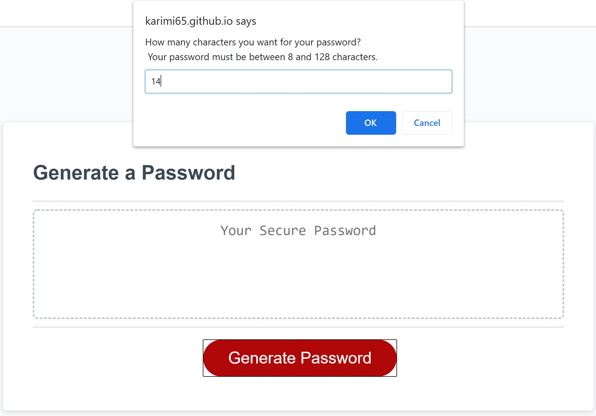
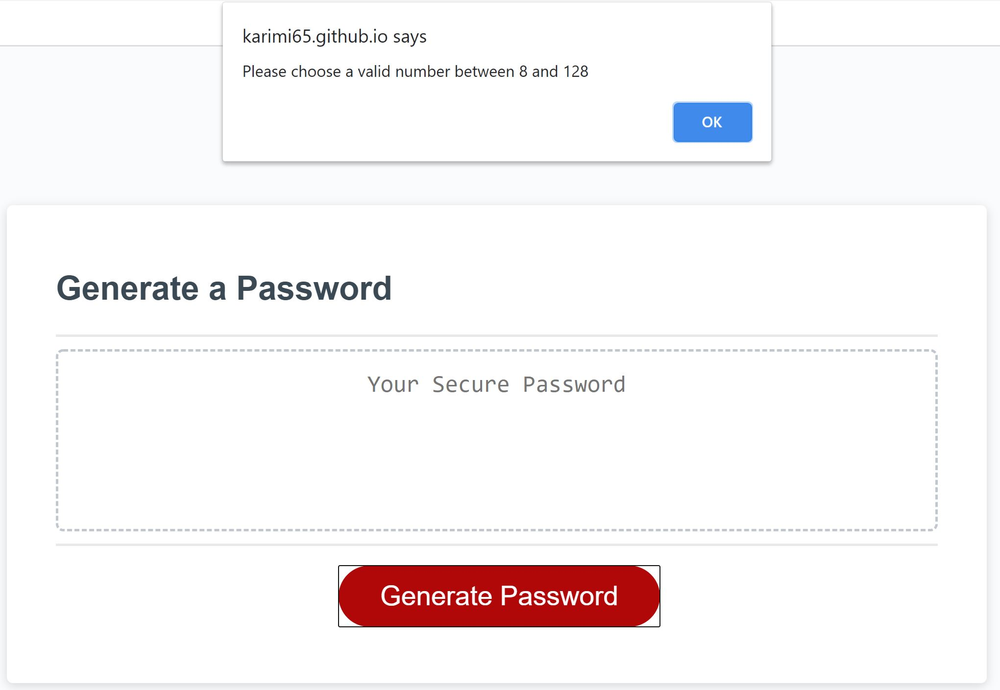
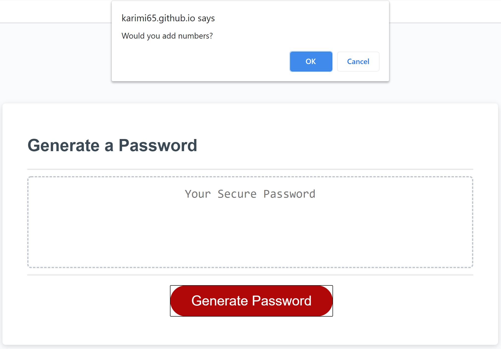
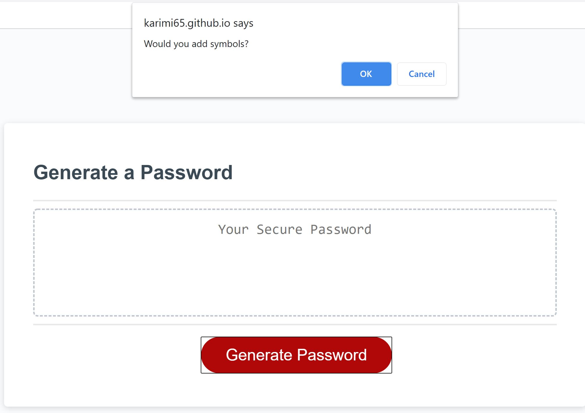
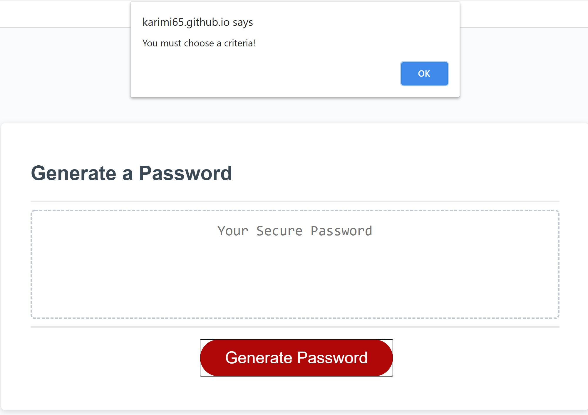
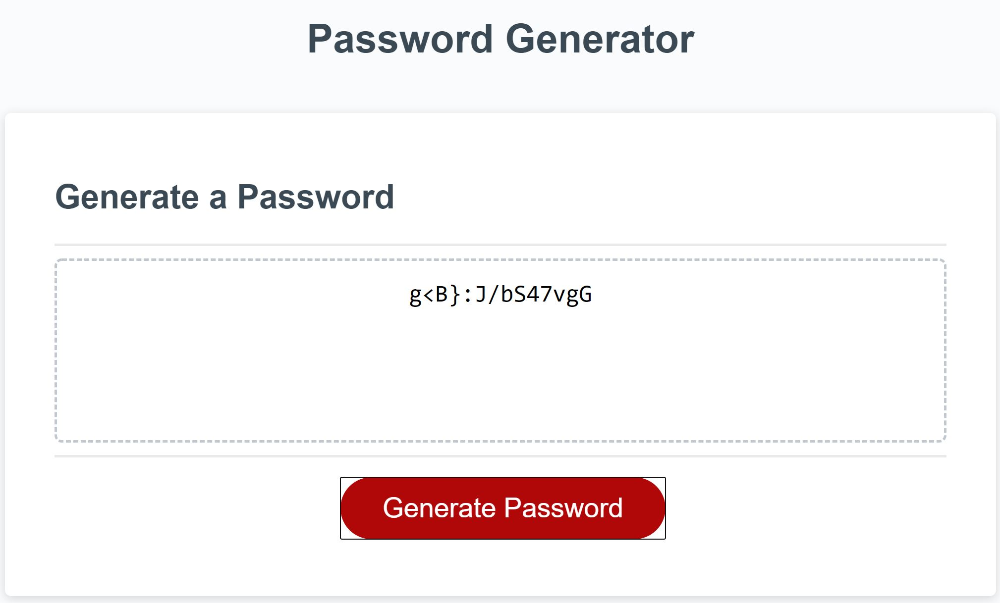

# Password Generator (using java script)

## Acceptance Criteria
*	When the user clicks on the button to generate a random password, a series of prompts should be answered and choose by the user, such as:
    *	Selecting character types (uppercases, lowercases, numbers, and/ symbols)
    *	Length of password
*	The user should choose at least one character type
*	Inputs should be valid
    *	Only numbers are accepted
    *	Input should be a number between 8 and 128
    *	No string/NaN

## Steps:

* By clicking on the "Generate Password" button, prompts will be shown:

* Prompt for insert a number between 8 and 128 for the length of password:

* If user insert a number less than 8 or greater than 128,an alert will be shown and then prompt coming to ask for entering a number between 8 and 128:

    also, if user insert nothing or strings, the process will not continue.

* Whenever a number between 8 and 128 is inserted, user will be asked to choose character types:

* User should choose at least one character type. If user does not select any character types, an alert will be shown and then prompts coming to ask for choosing character types:

* Based on the length of the password and character types chosen by the user, a random password will be shown inside the dashed box.
for example: 14 characters with 4 different criteria (Lowercases, Uppercases, Numbers and Symbols)

## Here is a link to deployed website:

[Deployed website for Password Generator](https://karimi65.github.io/password-generator/)

